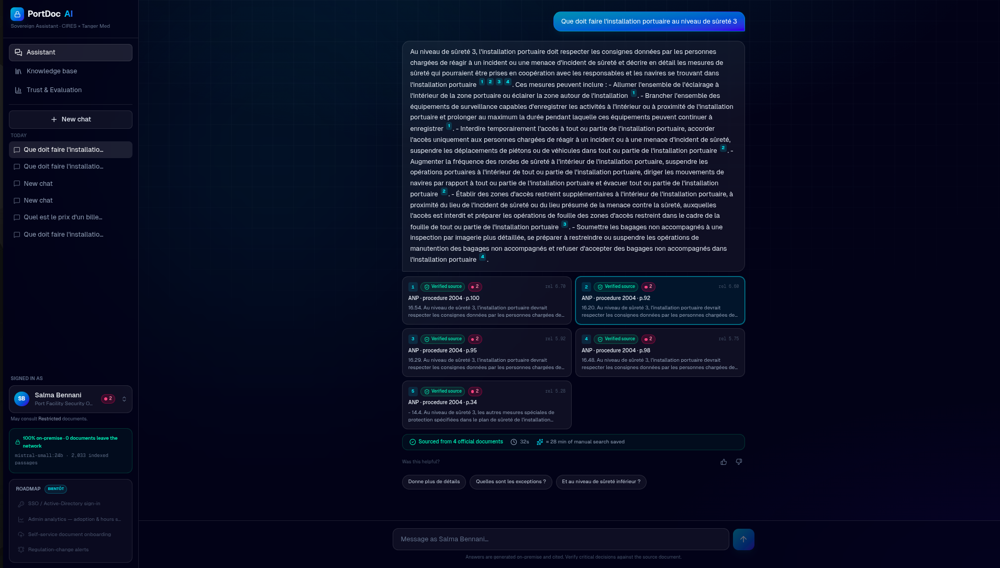
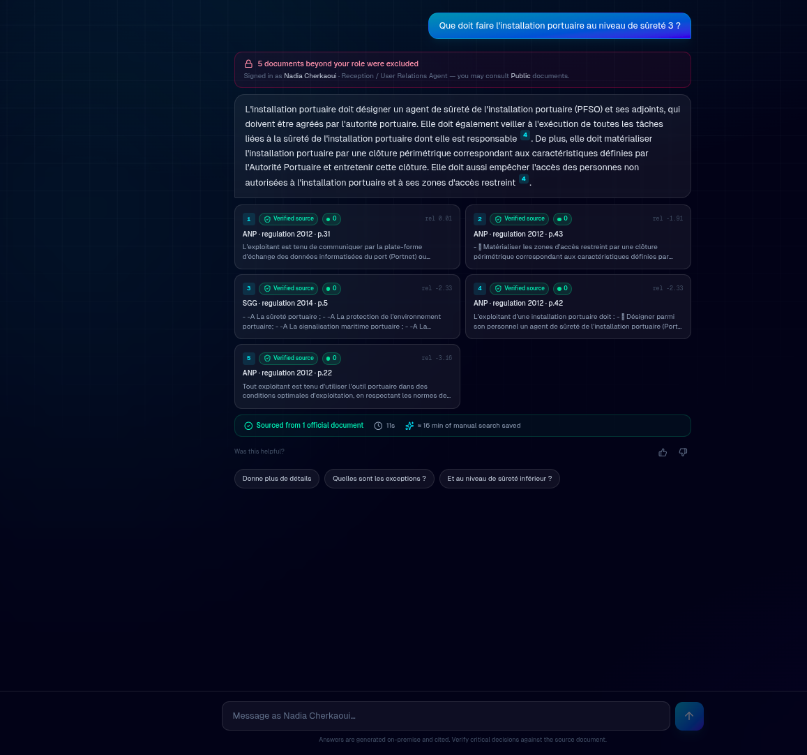
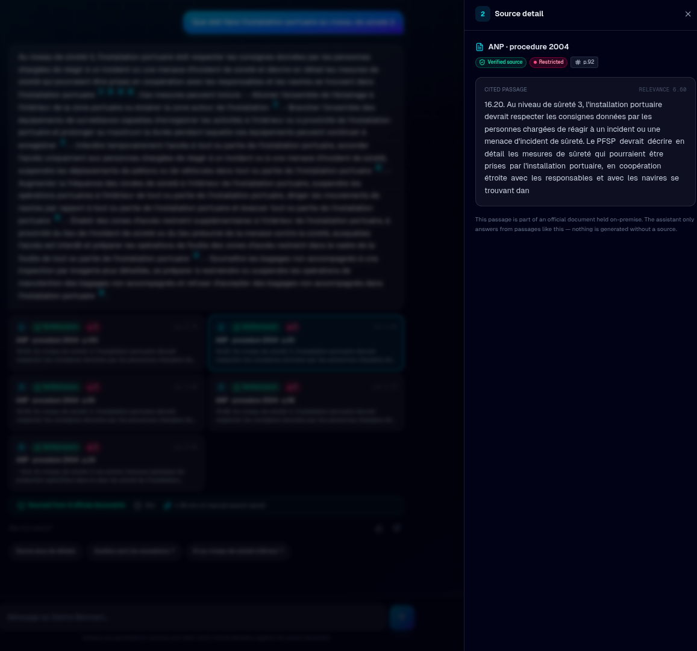
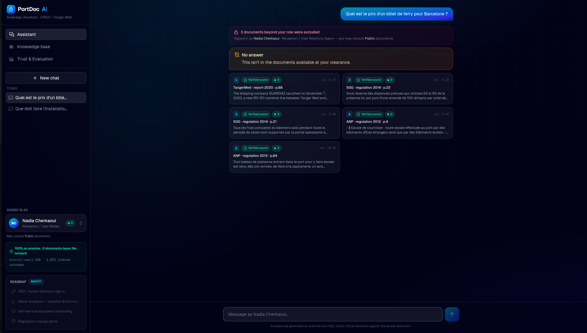
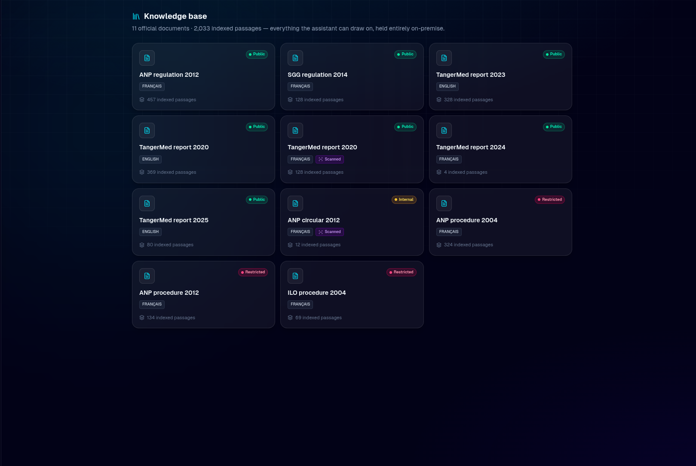
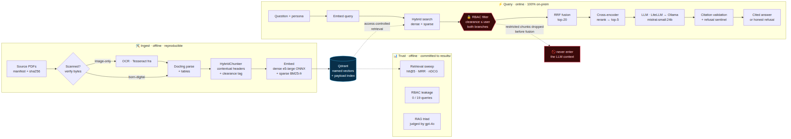
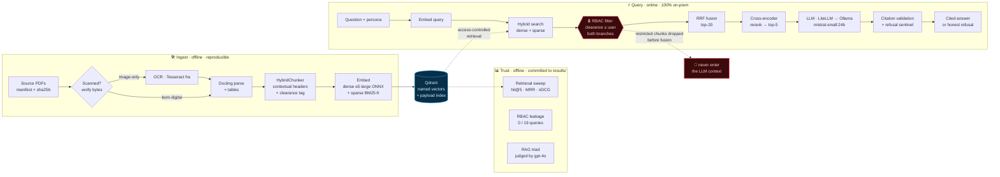
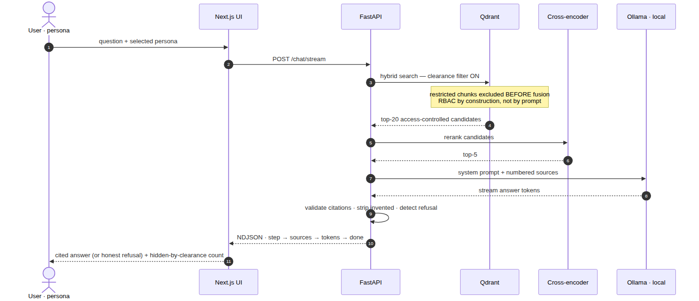
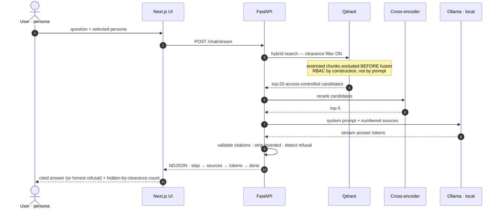
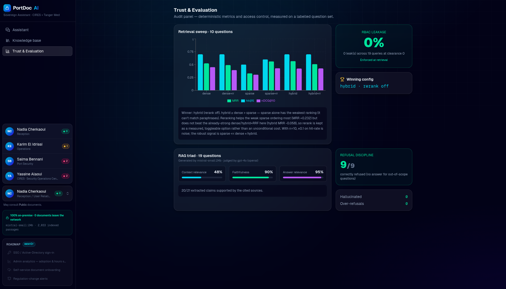

# PortDoc AI — Sovereign RAG over Port Security Documents

<p align="center">
  
  
  
  
  
</p>

A **fully self-hosted** retrieval-augmented assistant over port security & operational
documents, with **role-based access control enforced at retrieval**. Built as the kind of
internal assistant **CIRES Technologies** (Tanger Med's security / data-sovereignty
subsidiary) would deploy for port staff: every employee queries the same knowledge base,
but **sees only what their clearance permits**, every answer is **cited**, and **no data
ever leaves the host**.

```
Ask a question  →  access-controlled hybrid retrieval  →  reranked top-k  →  cited French
answer (or an honest refusal)  —  100% local: embeddings, reranker, and LLM all on-prem.
```

<p align="center">
  
  <br><sub><i>Ask in plain French → a cited answer drawn only from official documents, filtered to your clearance, generated 100% on-premise.</i></sub>
</p>

---

## Highlights

- **🔒 Row-level RBAC at the data layer** — each chunk carries a clearance level; a Qdrant
  payload filter excludes restricted chunks *before* fusion/rerank, so they never enter the
  LLM context. Same question, two roles, different answers. **Measured leakage: 0%.**
- **🔎 Hybrid retrieval** — dense (multilingual-e5-large, ONNX) + sparse (BM25-french),
  fused with Reciprocal Rank Fusion, then a cross-encoder reranker (bge-reranker-base).
- **🧾 Machine-checkable grounding** — every factual sentence must cite `[n]`; a parser
  validates citations and *strips invented ones*. An exact `<NO_ANSWER/>` sentinel makes
  refusal detectable and measurable.
- **🖼️ OCR pipeline** — scanned/born-digital routing (verified, not trusted from metadata)
  + a French OCR bake-off (`results/ocr_bakeoff.md`): Tesseract retained 99% of accents vs
  EasyOCR / RapidOCR.
- **📊 Measured *and* graded** — deterministic retrieval metrics + a config sweep + the 0% RBAC
  leakage check, **plus a strict generation eval** — the RAG triad (context relevance, faithfulness,
  answer relevance) graded by a stronger `gpt-4o` judge, with deterministic refusal accuracy. All
  committed to `results/` and rendered live in the UI's *Trust & Evaluation* panel.
- **💬 Product-grade UI** — a Next.js *Sovereign Command Center*: streaming answers, a persona
  switcher (the live RBAC demo), conversation history, a click-through source drawer, a document
  knowledge-base, plain-language business-value framing, and citation-forward grounding chips.

---

## See it in action

A real query, end to end — ask in plain language, get an answer where **every sentence cites an
official source**, click any `[n]` to read the exact passage, and never see a document above your
clearance.

### 1 · Grounded, cited answers — with click-through to the source

<table>
<tr>
<td width="50%"></td>
<td width="50%"></td>
</tr>
</table>

<sub>Every factual sentence ends in a <code>[n]</code> that resolves to a real, clickable source card
(left). Click it and the exact cited passage opens in a drawer with its document, page and clearance
(right). A parser validates every citation and <b>strips any the model invents</b> — grounding is
<i>checked</i>, not hoped for.</sub>

### 2 · Access control + honest refusal — in one view

<p align="center">
  
</p>

<sub>A Reception-desk user (clearance 0) asks something outside the corpus. Two things happen at once:
the <b>🔒 banner</b> reports how many sources were filtered out by clearance — excluded at retrieval,
before the model ever sees them (<b>measured leakage: 0 / 19 queries</b>) — and the assistant returns
an explicit <b>“No answer”</b> rather than inventing one (<b>9 / 9</b> out-of-scope &amp; adversarial
questions refused, <b>0 hallucinated</b>).</sub>

### 3 · The knowledge base — every document, classified

<p align="center">
  
</p>

<sub>11 official documents · 2,033 indexed passages, each tagged <b>Public · Internal · Restricted</b> —
the labels that drive access control — held entirely on-premise.</sub>

---

## Architecture

Two pipelines: an **offline ingest** that builds an integrity-checked index, and an **online
query** path that is access-controlled, reranked, and grounded. The security boundary (RBAC) is
enforced at the database query — **before** anything reaches the model.

<p align="center">
  
</p>

<details>
<summary>Mermaid source</summary>



</details>

**Request lifecycle** — one question, end to end:

<p align="center">
  
</p>

<details>
<summary>Mermaid source</summary>



</details>

**Why it's shaped this way**

- **Offline / online split** — indexing is heavy and reproducible (sha256 manifest, fingerprint-guarded); serving is light and stateless.
- **RBAC at the data layer** — the clearance filter runs inside *both* retrieval branches, so restricted material is gone before fusion, rerank, or the model. *A prompt can't leak what was never retrieved.*
- **Two-stage retrieval** — cheap hybrid recall (top-20) then an accurate cross-encoder rerank (top-5): precision without paying cross-encoder cost over the whole corpus.
- **Swappable by config** — LiteLLM puts ollama / vLLM / cloud behind one interface (one line to move the LLM); embeddings + reranker ship a documented CPU↔GPU profile.
- **Grounding is code, not vibes** — a parser validates every `[n]`, strips invented citations, and an exact `<NO_ANSWER/>` sentinel makes refusal measurable.
- **Eval is a build artifact** — retrieval, leakage, and the RAG triad regenerate into `results/` and render live in the UI.

**API surface** — `GET /health` · `POST /retrieve` · `POST /ask` · `POST /chat/stream` (NDJSON) · `GET /eval` · `GET /documents` · `GET /personas`

---

## Quickstart

### Prerequisites
- **Python 3.12** + [`uv`](https://docs.astral.sh/uv/)
- **Docker** (for Qdrant) · **[Ollama](https://ollama.com)** (local LLM)
- **Node.js 18+** (for the UI)
- *Optional, only to re-ingest from source PDFs:* `tesseract-ocr tesseract-ocr-fra poppler-utils imagemagick`

> The processed `data/corpus/chunks.jsonl` is committed, so you can run the full system
> **without the raw PDFs** — just build the index from it (step 4). Re-ingestion from
> source PDFs is optional (see [Re-ingestion](#re-ingestion-optional)).

### Run it

**Fastest:** `./setup.sh` runs steps 1–4 (installs uv + Ollama if missing, starts Qdrant,
pulls the model, builds the index) — then jump to step 5. Or step by step:

```bash
# 1. Python env
curl -LsSf https://astral.sh/uv/install.sh | sh
uv sync --extra dev

# 2. Vector DB  (don't `docker rm` it — the index lives inside the container)
docker run -d --name qdrant -p 6333:6333 qdrant/qdrant   # already created? → docker start qdrant

# 3. Local LLM — Ollama uses the GPU automatically if present
ollama pull mistral-small:24b

# 4. Build the index from the committed chunks  (one-time; ~17 min on CPU)
make index

# 5. Serve — two terminals
make api          # FastAPI  → http://localhost:8000
make ui           # Next.js  → http://localhost:3000
```

**Check each step is green before the next:**

```bash
curl -s localhost:6333/healthz                          # Qdrant: healthz check passed
curl -s localhost:8000/health | python3 -m json.tool    # expect "qdrant_points": 2033
ollama ps                                               # mistral-small:24b · "100% GPU"
```

Open **http://localhost:3000** → ask a security question as *Salma (PFSO, clearance 2)*,
then switch to *Nadia (Reception, clearance 0)* and ask the same thing — watch the
restricted sources disappear (**🔒 5 hidden**).

> **Latency (L4 · `mistral-small:24b` ≈ 17 tok/s):** streamed answers start in **~2–4 s**; a full
> cited answer completes in **~10–15 s**, refusals in **~3–4 s** — fully local. Want it snappier?
> Use a lighter model (`mistral-nemo:12b`) or lower `PORTDOC_GEN_MAX_TOKENS`. CPU-only is the
> sovereignty fallback (minutes/answer); the `make` steps are identical either way.

### Pre-flight for a live demo

The **first** generation after a fresh start loads the model into VRAM (a one-time ~10–50 s);
every call after is fast. Warm **and pin** the model before presenting so it never reloads
mid-session:

```bash
curl -s localhost:11434/api/generate \
  -d '{"model":"mistral-small:24b","prompt":"ok","keep_alive":-1}' >/dev/null   # warm + keep resident
```

Green-light check: `/health` must show `qdrant_points: 2033`. If it shows `0`, the index
didn't persist (e.g. the Qdrant container was recreated) — re-run `make index`.

### Expose it publicly (Cloudflare — one tunnel)

The UI proxies `/api` to the backend **server-side** (`next.config.mjs` rewrite), so a single
tunnel on port 3000 exposes the whole app — streaming included, no CORS, no second URL. With
`make api` (:8000) and `make ui` (:3000) both running:

```bash
cloudflared tunnel --url http://localhost:3000
```

Open the printed `https://….trycloudflare.com` link. Keep `make api` running (the proxy
forwards to it). Quick tunnels need no account; the URL is ephemeral and changes each run —
for a stable URL use a named tunnel + a Cloudflare account.

### Troubleshooting

| Symptom | Fix |
|---|---|
| `/health` shows `qdrant_points: 0` | Index missing → `make index` (don't `docker rm` the qdrant container) |
| Port 8000 already in use | `uv run uvicorn portdoc.api.main:app --port 8001`, then set `frontend/.env.local` → `NEXT_PUBLIC_API_BASE=http://localhost:8001` |
| UI loads but every answer errors | Browser can't reach the API. On a remote/Lightning host set `frontend/.env.local` → `NEXT_PUBLIC_API_BASE=<public URL of port 8000>` (CORS is open) |
| First answer ~30–50 s, the rest fast | Cold model load — run the warm-up above before the demo |
| `ollama ps` shows `100% CPU` | Ollama didn't grab the GPU; restart `ollama serve` once the driver is up |

### Make targets
`make install · fetch · index · ingest · sweep · search Q="…" · api · ui · test`

---

## Evaluation

Evaluation is **first-class** here — three reproducible layers, all committed to
[`results/`](results/): deterministic **retrieval** metrics, the **access-control** proof, and a
strict **generation-quality** eval graded by a stronger judge.

<p align="center">
  
  <br><sub><i>Not a slide — rendered live in the product from the committed <a href="results/"><code>results/</code></a>: the retrieval config sweep, the 0% RBAC-leakage shield, and the RAG triad judged by a stronger model.</i></sub>
</p>

**1 · Retrieval** — deterministic, no LLM (hand-labelled set, fingerprint-guarded vs re-chunk drift):

| Mode | hit@5 | MRR | nDCG@10 |
|---|---|---|---|
| dense | 0.70 | 0.524 | 0.450 |
| sparse | 0.50 | 0.329 | 0.304 |
| **hybrid (winner)** | **0.70** | **0.566** | 0.424 |

**2 · Access control** — RBAC leakage **0 / 19 queries (0%)**: no restricted chunk surfaced at
clearance 0. Enforced at retrieval *by construction*, not by a prompt instruction.

**3 · Generation quality** — the RAG triad + refusal, strict rubric, judged by `gpt-4o`
(`make eval-gen` → [`results/generation.md`](results/generation.md)):

| Metric | Score |
|---|---|
| Context relevance (precision@5, rerank off → **on**) | **48% → 62%** |
| Faithfulness — every cited claim backed by its source | **90%** |
| Answer relevance | **95%** |
| Refusal — out-of-corpus + adversarial | **9 / 9 · 0 hallucinated** |

The judge runs **offline over public docs** — the served product stays 100% local. What the numbers
say: even with recall-first retrieval (~50% precision), faithfulness is **90%** and hallucination is
**0** — the generator grounds in the relevant chunks and refuses what it can't support. Cross-encoder
**reranking is on** in the live path: it lifts context precision **+14pp** for ~150 ms (negligible vs
generation); on rank-order, hybrid+RRF already saturates, so rerank is a precision lever, not recall.

Regenerate: `make sweep` (retrieval + leakage) · `make eval-gen` (generation).

---

## Tech stack & rationale

| Layer | Choice | Why |
|---|---|---|
| Parsing / OCR | Docling + **Tesseract `fra`** | best French accent retention (measured) |
| Chunking | Docling `HybridChunker`, 512-tok cap, contextual headers | structure-aware; sized with the Qwen3-Embedding tokenizer |
| Vector DB | **Qdrant** | lightest self-hostable DB with native sparse + server-side RRF fusion |
| Dense embed | `multilingual-e5-large` (ONNX/FastEmbed) | multilingual, ~10× faster than fp32 torch on CPU |
| Sparse embed | BM25-french | commercially-licensed multilingual lexical signal |
| Reranker | `bge-reranker-base` (MIT, multilingual) | jina-v2 multilingual rejected (CC-BY-NC) |
| LLM | Mistral Small 24B via Ollama (swappable via LiteLLM) | French-native, self-hosted; one-line swap to vLLM/cloud |
| API / UI | FastAPI + Next.js 14 (Tailwind, Recharts) | streaming console; API is the product |

All retrieval/generation runs locally — no hosted embedding or LLM API.

---

## Project structure

```
src/portdoc/
  ingestion/   fetch · parse (scan routing + OCR) · chunk
  index/       embed (dense+sparse) · store (Qdrant schema, hybrid search, RBAC filter)
  retrieval/   rerank · pipeline (retrieve = hybrid → RBAC → rerank → top-k)
  generation/  llm (LiteLLM) · prompts · citations (validating parser) · answer
  eval/        retrieval_metrics · make_dataset · run (sweep + leakage) · generation_eval (RAG triad + refusal)
  api/         main (FastAPI) · schemas · personas
frontend/      Next.js "Sovereign Command Center" (app/components/*)
data/          corpus/manifest.yaml · corpus/chunks.jsonl (committed) · eval/qa_dataset.json
results/       sweep · leakage · ocr_bakeoff · generation (RAG triad)
tests/         59 unit tests (metrics, citations, chunking, filters, …)
```

## Configuration

Defaults run fully local — no `.env` needed. Override any setting via `PORTDOC_*` env vars
(see `.env.example`), e.g. to swap the LLM backend:

```bash
PORTDOC_LLM_BACKEND=ollama        # ollama | vllm | openai
PORTDOC_LLM_MODEL=mistral-small:24b
```

## Re-ingestion (optional)

The repo ships `chunks.jsonl`, so this is only needed to rebuild from source PDFs:

```bash
# place the raw PDFs in data/corpus/raw/ (filenames matching manifest ids), then:
make ingest        # parse + OCR + chunk + index   (needs tesseract/poppler/imagemagick)
```

`scripts/make_scan.sh` regenerates the synthetic scanned circular used for the OCR pipeline.

---

## Limitations & roadmap

- **Latency** — generation runs on an on-prem GPU (Mistral Small 24B on an L4: ~2–4 s to first
  token, ~10–15 s full answer). CPU-only is the sovereignty fallback (minutes/answer).
- **Small eval set** — n = 10 grounded / 19 total: directional, not a leaderboard. The harness
  scales to more questions as the corpus grows.
- **Scoped out:** Arabic/Darija (FR/EN only). Documented, not built.
- **Roadmap:** SOTA GPU stack (Qwen3-Embedding + bge-m3 learned-sparse + Qwen3-Reranker); admin
  usage analytics; self-service document onboarding; SSO / Active-Directory auth.

---

*Built incrementally with engineering rigor — unit-tested metrics, integrity-checked corpus,
honest evaluation (including negative findings), and reproducibility throughout.*
